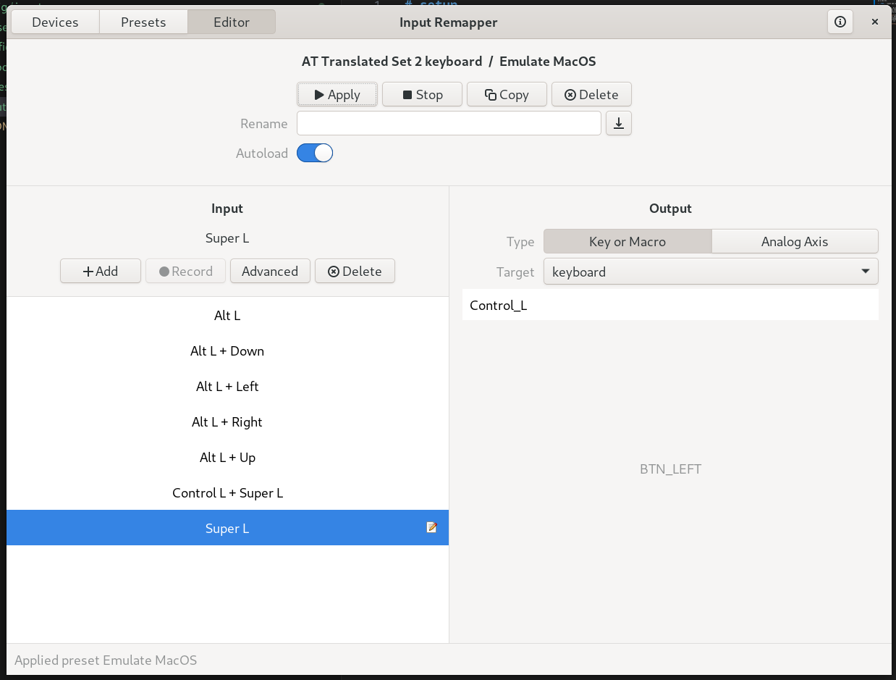
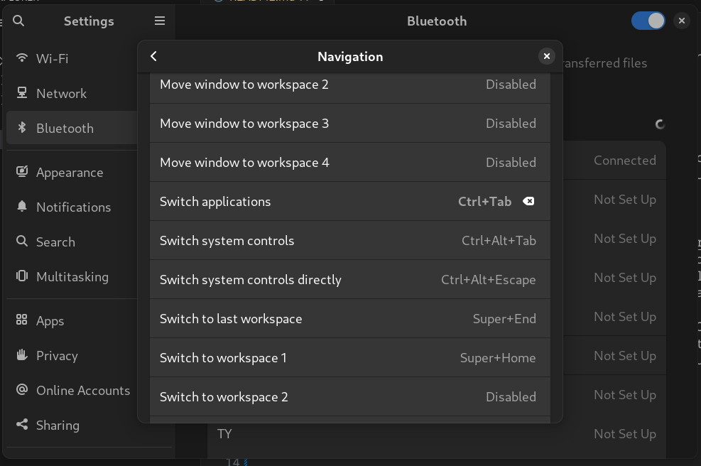
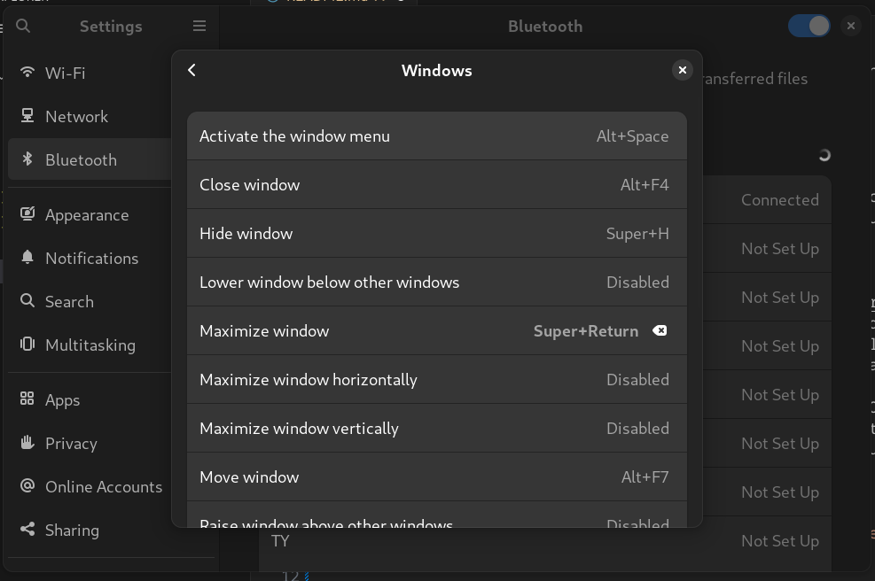

# Setup
dotfiles and other things that are good to have when setting up a new env.

* __TODO__ - maybe add some secrets via ansible vault

### Keyboard
For better or worse, my most deeply engrained keyboard muscle memory maps to the MacOS style conventions. This means that when using Linux, I remap the keyboard to be more similar to MacOS. Here are the steps to achieve that.

1. Use [Input Remapper](https://github.com/sezanzeb/input-remapper) Linux GUI app to handle some of the more important keyboard remapping. This is mainly to remap the Alt key to (where Command usually sits on MacOS) to Control. It also handles remapping the Option + arrow key functionality in MacOS to work like Home/End and Control + Home/End, and emulating the Cmd + Tab application switching from MacOS. Importantly, this also remaps the Super key functionality to map to Control + Super. This is important to know if you need to use specific Super key functionality in Linux. 

Use the `.config/input-remapper` dotfiles to configure Input Remapper on a new machine. Note that you will have to copy the `Emulate MacOS.json` file for each keyboard you want to remap.

2. Make two small changes to the keyboard shortcuts in Gnome settings

    * App switching 
    
    * Window maximizing. This is a very minor update to match the defaults in the MacOS Rectangle app
    

#### Window management
I actually prefer the window management in Gnome more than MacOS. You can install [Rectangle for MacOS](https://rectangleapp.com/) which provides basically the same window management that Gnome provides out of the box.